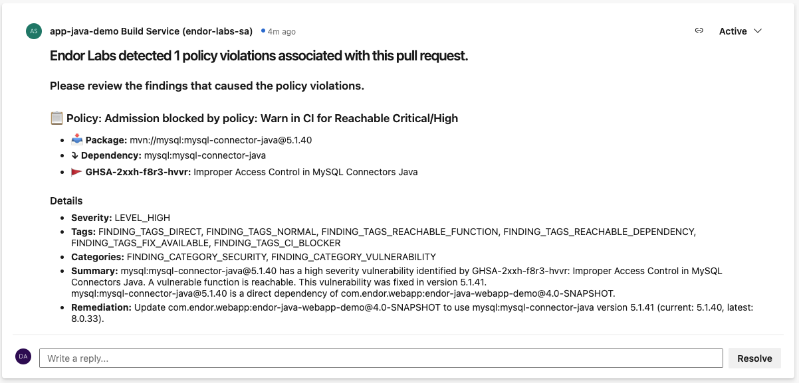
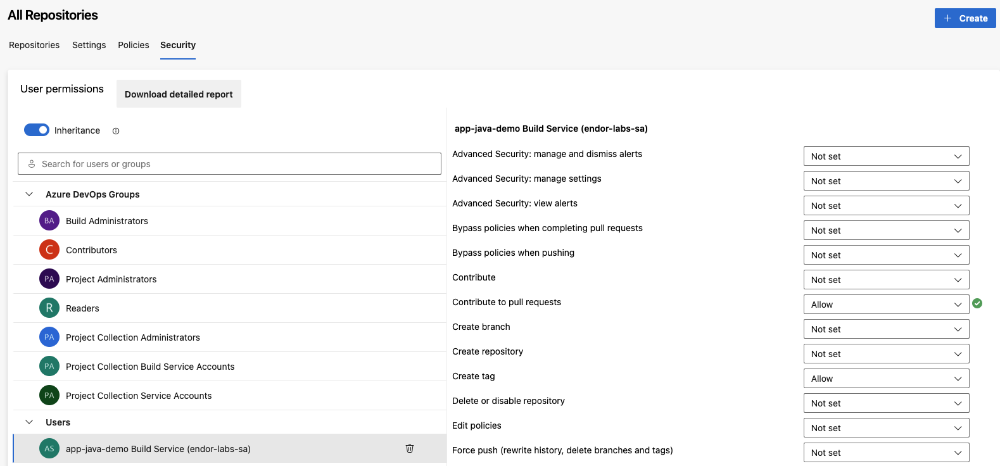

# Adding Endor Comments to Azure Pipelines PRs

This PowerShell script reads the JSON output from an Endor Labs scan and posts the findings as a comment to a Pull Request (PR) in Azure Pipelines. The output can be customised as required:



## Prerequisites

* The Azure Pipeline yaml example requires an API key and secret for Endor Labs, which should be set up as environment variables in your Azure DevOps pipeline.
* Ensure that you have Build Validation turned on for your main branch:
  1. Go to the code repository settings for your project
  2. Go to the Policies tab
  3. Go to Branch Policies
  4. Select your main branch (to which you will raise PRs)
  5. Under Build Validation, add a new policy with an Automatic trigger, make it a Required policy (if blocking).

## Permissions

Ensure that the pipeline user has sufficient access to add comments to a PR. This can be done as follows:
1. Go to the code repository settings for your project
2. Go to the Security tab
3. Select the user Build Service
4. Set "Contribute to pull requests" permission to "Allow"



## Usage in Azure DevOps Pipeline

To use this script in an Azure DevOps pipeline, follow the steps below:

1. Go to Azure DevOps > Pipelines > Library and upload the AddEndorCommentToPR.ps1 as a secure file. Once uploaded select the file and add permission for your pipeline to access the file.
2. Download the script within your pipeline:

```yaml
- task: DownloadSecureFile@1
  condition: eq(variables['Build.Reason'], 'PullRequest')
  name: downloadPs1
  inputs:
    secureFile: 'AddEndorCommentToPR.ps1' # Name of the secure file
  displayName: 'Download Secure PowerShell Script'
```

3. Run an Endor Labs scan on PRs

Add the following step to your Azure DevOps pipeline to run the Endor Labs scan and output the results to a JSON file. Adjust the `--pr-baseline` to your baseline branch as required:

```yaml
- script: |
    BRANCH_NAME=$(echo $(Build.SourceBranch) | sed 's/refs\/heads\///')
    ./endorctl scan --api-key $(ENDOR_API_KEY) --api-secret $(ENDOR_API_SECRET) -n $(ENDOR_NAMESPACE) --output-type=json --pr --pr-baseline=main > output.json
  displayName: 'Run an Endor Labs scan on PRs'
  condition: eq(variables['Build.Reason'], 'PullRequest')
```

4. Post Endor Results to the PR

```yaml
- task: PowerShell@2
  condition: eq(variables['Build.Reason'], 'PullRequest')
  displayName: Post Endor Results to the PR
  env:
    SYSTEM_ACCESSTOKEN: $(System.AccessToken)  
  inputs:
      targetType: filePath
      filePath: $(downloadPs1.secureFilePath)
      arguments: '-jsonFilePath $(Build.SourcesDirectory)/output.json'
```

5. Ensure you have created an [Action Policy](https://docs.endorlabs.com/managing-policies/action-policies/) within Endor Labs which will trigger for the application.

6. Optional: Test the policy by introducing a known vulnerable library to your application's manifest within a PR.
